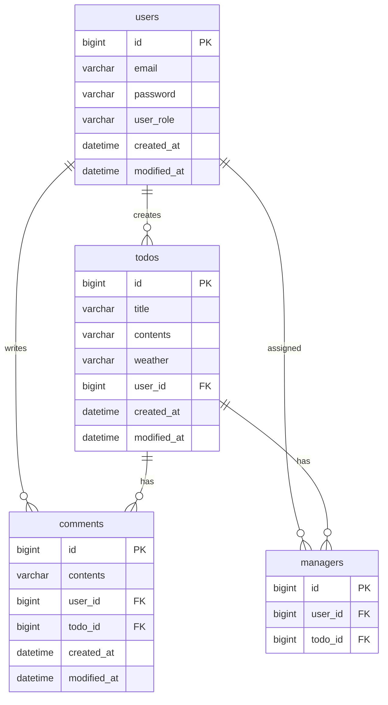

# Todo 관리 시스템

일정 관리와 담당자 지정이 가능한 Todo 관리 시스템입니다. 날씨 정보를 함께 기록하여 일정 컨텍스트를 보다 풍부하게 제공합니다.

## 기술 스택

- Java 17
- Spring Boot 3.2
- Spring Data JPA
- Spring Security
- MySQL 8.0
- Gradle
- JWT
- BCrypt
- JUnit5
- Mockito

## ERD



## API 명세

| Method | URI | 설명 | 권한 |
|--------|-----|------|------|
| POST | /auth/signup | 회원가입 | ALL |
| POST | /auth/signin | 로그인 | ALL |
| POST | /todos | Todo 생성 | USER |
| GET | /todos | Todo 목록 조회 | USER |
| GET | /todos/{todoId} | Todo 상세 조회 | USER |
| POST | /todos/{todoId}/comments | 댓글 작성 | USER |
| GET | /todos/{todoId}/comments | 댓글 목록 조회 | USER |
| POST | /todos/{todoId}/managers | 담당자 지정 | USER |
| GET | /todos/{todoId}/managers | 담당자 목록 조회 | USER |
| DELETE | /admin/comments/{commentId} | 댓글 삭제 | ADMIN |
| PATCH | /admin/users/{userId} | 사용자 권한 변경 | ADMIN |

## 주요 기능

1. **인증/인가**
   - JWT 기반 인증
   - USER/ADMIN 권한 구분
   - BCrypt 암호화

2. **Todo 관리**
   - Todo CRUD
   - 페이징 처리
   - 날씨 정보 자동 기록

3. **담당자 관리**
   - 다중 담당자 지정
   - 담당자 권한 검증

4. **어드민 기능**
   - 사용자 권한 관리
   - 댓글 관리
   - AOP 기반 어드민 작업 로깅

## 오류 처리

| 상태 코드 | 에러 타입 | 설명 |
|-----------|-----------|------|
| 400 | InvalidRequestException | 잘못된 요청 파라미터 |
| 401 | AuthException | 인증 실패 |
| 403 | AuthException | 권한 없음 |
| 404 | InvalidRequestException | 리소스 없음 |
| 500 | ServerException | 서버 내부 오류 |

### 에러 응답 형식
```json
{
    "status": "BAD_REQUEST",
    "code": 400,
    "message": "잘못된 요청입니다."
}
```
